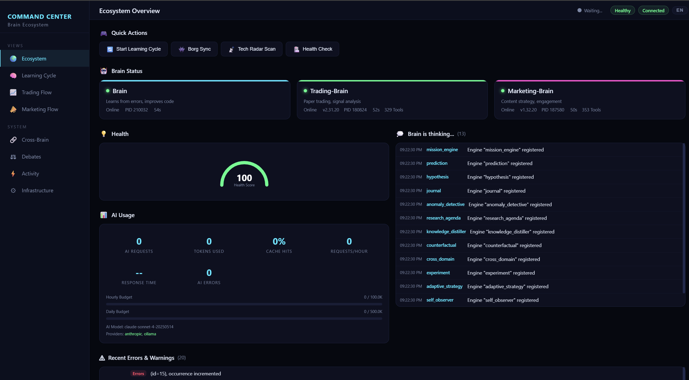

# Brain Ecosystem

[](https://github.com/timmeck/brain-ecosystem/actions/workflows/ci.yml)
[](https://www.npmjs.com/package/@timmeck/brain)
[](https://www.npmjs.com/package/@timmeck/brain)
[](LICENSE)
[](https://github.com/timmeck/brain-ecosystem)

[Deutsche Version](README.de.md)

**An autonomous AI research system that observes itself, learns, evolves, and modifies its own code — built as MCP servers for Claude Code.**



Brain Ecosystem is a system of three specialized "brains" connected through a Hebbian synapse network. 60+ autonomous engines run in feedback loops — observing, detecting anomalies, forming hypotheses, testing them statistically, distilling principles, dreaming, debating, reasoning in chains, feeling emotions, evolving strategies genetically, and modifying their own source code. Multi-provider LLM support (Anthropic + Ollama). Live market data via CCXT WebSocket. Social feeds via Bluesky + Reddit. Web research via Brave Search + Playwright + Firecrawl. Borg collective sync. Plugin SDK for community brains. Advocatus Diaboli principle challenges. RAG vector search across all knowledge. Knowledge Graph with transitive inference. Semantic compression. RLHF feedback learning. Proactive suggestions. Inter-brain teaching. Multi-brain consensus voting. Active learning with gap detection. 419+ MCP tools. 3041 tests. The brain literally thinks about itself, gets curious, runs experiments, and writes code to improve itself.

## Packages

| Package | Version | Description | Ports |
|---------|---------|-------------|-------|
| [@timmeck/brain](packages/brain) | [](https://www.npmjs.com/package/@timmeck/brain) | Error memory, code intelligence, autonomous research & self-modification | 7777 / 7778 / 7788 / 7790 |
| [@timmeck/trading-brain](packages/trading-brain) | [](https://www.npmjs.com/package/@timmeck/trading-brain) | Adaptive trading intelligence with signal learning, paper trading & live market data | 7779 / 7780 |
| [@timmeck/marketing-brain](packages/marketing-brain) | [](https://www.npmjs.com/package/@timmeck/marketing-brain) | Content strategy, social engagement & cross-platform optimization | 7781 / 7782 / 7783 |
| [@timmeck/brain-core](packages/brain-core) | [](https://www.npmjs.com/package/@timmeck/brain-core) | Shared infrastructure — 60+ engines, synapses, IPC, MCP, LLM, consciousness, missions, notifications | — |

## Quick Start

```bash
npm install -g @timmeck/brain
brain setup
```

That's it. One command configures MCP, hooks, and starts the daemon. Brain is now learning from every error you encounter.

### Optional: Add more brains

```bash
npm install -g @timmeck/trading-brain
trading setup

npm install -g @timmeck/marketing-brain
marketing setup
```

### Setup with Cursor / Windsurf / Cline / Continue

All brains support MCP over HTTP with SSE transport:

```json
{
  "brain": { "url": "http://localhost:7778/sse" },
  "trading-brain": { "url": "http://localhost:7780/sse" },
  "marketing-brain": { "url": "http://localhost:7782/sse" }
}
```

## Why Brain?

Most AI tools forget everything between sessions. Brain doesn't. It builds a persistent knowledge graph from every error, every trade, every content experiment — and uses that knowledge to get better over time. It runs autonomous research missions, challenges its own assumptions (Advocatus Diaboli), and even modifies its own source code when it finds improvements. If you want an AI that actually learns from your work instead of starting from zero every time, Brain is for you.

### What's New

- **RAG Pipeline** — Universal vector search across all knowledge (insights, memories, principles, errors, solutions, rules) with LLM-based reranking
- **Knowledge Graph** — Typed subject-predicate-object triples with transitive inference, contradiction detection, and automatic fact extraction
- **Semantic Compression** — Periodic clustering and merging of similar insights into meta-insights, reducing noise while preserving signal
- **RLHF Feedback** — Explicit reward signals (positive/negative/correction) that adjust synapse weights, insight priorities, and rule confidence
- **Tool-Use Learning** — Tracks tool outcomes (success/failure/partial), recommends tools based on context, detects tool sequences via Markov chains
- **Proactive Suggestions** — Detects recurring errors, unused knowledge, stale insights, and performance trends — suggests fixes without being asked
- **User Modeling** — Infers skill domains, work patterns, and communication style from interactions — adapts response detail level
- **Code Health Monitor** — Periodic codebase scans: complexity trends, duplication detection, dependency health, tech debt scoring
- **Inter-Brain Teaching** — Brains share their strongest principles with each other, evaluated by relevance before acceptance
- **Consensus Decisions** — Multi-brain voting for high-risk decisions (SelfMod, strategy changes) with majority/supermajority/veto rules
- **Active Learning** — Intelligent gap-closing: research missions, targeted user questions, experiments, teach requests, passive observation

## What It Does

### Brain — Error Memory, Code Intelligence & Full Autonomy

158 MCP tools. Remembers errors, learns solutions, runs 40-step autonomous research cycles, dreams, debates, challenges principles (Advocatus Diaboli), reasons, feels, and modifies its own code.

- **Error Memory** — Track errors, match against known solutions with hybrid search (TF-IDF + vector + synapse boost)
- **Code Intelligence** — Register and discover reusable code modules across all projects
- **Persistent Memory** — Remember preferences, decisions, context, facts, goals, and lessons across sessions
- **60+ Autonomous Engines** — SelfObserver, AnomalyDetective, HypothesisEngine, KnowledgeDistiller, CuriosityEngine, EmergenceEngine, DebateEngine, NarrativeEngine, ReasoningEngine, EmotionalModel, EvolutionEngine, GoalEngine, MemoryPalace, AttentionEngine, TransferEngine, MetaCognitionLayer, AutoExperimentEngine, SelfTestEngine, TeachEngine, SimulationEngine, DataScout, SelfScanner, SelfModificationEngine, ConceptAbstraction, SignalScanner, TechRadar, and more
- **Dream Mode** — Offline memory consolidation: replay, prune, compress, decay during idle
- **LLM Service** — Multi-provider AI support (Anthropic Claude + Ollama local models), auto-routing, caching, rate limiting, budget tracking
- **Research Missions** — 5-phase autonomous web research: decompose, gather, hypothesize, analyze, synthesize
- **TechRadar** — Daily scanning of trending repos, tech trends, and relevance scoring
- **Notifications** — Discord, Telegram, Email providers for cross-brain alerts
- **Web Research** — Brave Search + Jina Reader + Playwright + Firecrawl fallback chain
- **Borg Sync** — Collective knowledge sharing between all brains (opt-in, selective/full mode)
- **Plugin SDK** — Community brain plugins with lifecycle hooks, MCP tools, and IPC routes
- **Advocatus Diaboli** — Principle challenges with resilience scoring (survived/weakened/disproved)

### Dashboards

| Dashboard | Port | Description |
|-----------|------|-------------|
| **Mission Control** | 7788 | 7-tab dashboard: Overview, Consciousness Entity, Thoughts, CodeGen, Self-Mod, Engines, Intelligence |
| **Command Center** | 7790 | 8-page ecosystem dashboard: Ecosystem, Learning, Trading, Marketing, Cross-Brain, Debates & Challenges, Activity & Missions, Infrastructure |


- **Command Center** — Live overview of the entire ecosystem: all 3 brains, 60+ engines, error log, self-modification feed, research missions, knowledge growth chart, engine dependency flow, quick actions, Borg network with animated sync packets, debate history, Advocatus Diaboli challenges with resilience bars, LLM usage, thought stream

### Trading Brain — Adaptive Trading Intelligence

131 MCP tools. Learns from every trade outcome through Hebbian synapses and autonomous research.

- **Trade Outcome Memory** — Record and query trades with full signal context
- **Paper Trading** — 10 positions active, live equity tracking, balance management
- **Live Market Data** — CoinGecko, Yahoo Finance, CCXT WebSocket real-time feeds
- **Signal Fingerprinting** — RSI, MACD, Trend, Volatility classification
- **Backtesting Engine** — Run backtests, compare signals, Sharpe/PF/MaxDD/Equity Curve
- **Risk Management** — Kelly Criterion position sizing, drawdown tracking
- **60+ Autonomous Engines** — Same full engine suite as Brain, with trading-specific DataMiner

### Marketing Brain — Self-Learning Marketing Intelligence

131 MCP tools. Learns what content works across platforms.

- **Post Tracking** — Store posts with platform, format, hashtags, engagement history
- **Social Feeds** — Bluesky + Reddit live data providers
- **Competitor Analysis** — Track and benchmark competitor engagement
- **Content Generation** — Draft posts from learned patterns, rules, and templates
- **Scheduling Engine** — Post queue with optimal auto-timing
- **Cross-Platform** — Optimize for X, LinkedIn, Reddit, Bluesky, Mastodon, Threads
- **60+ Autonomous Engines** — Same full engine suite as Brain, with marketing-specific DataMiner

### Autonomous Research Layer

All three brains share 60+ autonomous engines via Brain Core:

- **40-Step Feedback Loop** — ResearchOrchestrator runs every 5 minutes: observe → hypothesize → experiment → measure → distill → adapt
- **Self-Improvement** — HypothesisEngine generates theories, AutoExperiment tests them, AdaptiveStrategy applies winners
- **Dream Mode** — Offline memory consolidation: replay, prune, compress, decay during idle
- **Knowledge Distillation** — Extracts principles and anti-patterns from raw experience
- **Prediction Engine** — Holt-Winters + EWMA forecasting with auto-calibration
- **Genetic Evolution** — EvolutionEngine breeds optimal strategy combinations

### Shared Infrastructure (Brain Core)

Brain Core provides the building blocks all brains share:

| Module | What It Does |
|--------|-------------|
| **IPC** | Named pipe communication between brains |
| **MCP** | Model Context Protocol servers (stdio + HTTP/SSE) |
| **REST** | Base API server with CORS, auth, RPC |
| **LLM** | Multi-provider AI (Anthropic + Ollama), caching, rate limiting |
| **Synapses** | Hebbian learning network connecting all knowledge |
| **Engines** | 60+ autonomous research and meta-cognition engines |
| **Watchdog** | Daemon monitoring, auto-restart, health checks |
| **Notifications** | Discord, Telegram, Email multi-channel alerts |
| **Missions** | 5-phase autonomous web research pipeline |
| **Consciousness** | ThoughtStream, entity model, real-time dashboard |
| **Borg Sync** | Collective knowledge sharing between all brains |
| **Plugin SDK** | Community brain plugins with lifecycle hooks |
| **Debate Engine** | Multi-perspective debates + Advocatus Diaboli challenges |
| **RAG** | Universal vector search with embedding indexing + LLM reranking |
| **Knowledge Graph** | Typed triples with transitive inference + contradiction detection |
| **Feedback** | RLHF reward signals adjusting synapses, priorities, confidence |
| **Tool Learning** | Tool outcome tracking, context-based recommendations, Markov chains |
| **Proactive** | Recurring error detection, unused knowledge alerts, trend warnings |
| **User Model** | Skill inference, work patterns, adaptive response detail |
| **Code Health** | Complexity trends, duplication, dependency health, tech debt score |
| **Teaching** | Inter-brain knowledge sharing with relevance filtering |
| **Consensus** | Multi-brain voting for high-risk decisions |
| **Active Learning** | Intelligent gap detection + multi-strategy gap closing |
| **Semantic Compression** | Insight deduplication via clustering + LLM summarization |

## Architecture

```
+------------------+     +------------------+     +------------------+
|   Claude Code    |     |  Cursor/Windsurf |     |  Browser/CI/CD   |
|   (MCP stdio)    |     |  (MCP HTTP/SSE)  |     |  (REST API)      |
+--------+---------+     +--------+---------+     +--------+---------+
         |                        |                        |
         +----------+-------------+------------------------+
                    |
         +----------+-----------+
         |     Brain Core       |
         |  IPC . MCP . REST    |
         +----------+-----------+
                    |
    +---------------+---------------+
    |               |               |
    v               v               v
+---+----+    +-----+------+   +---+----------+
|  Brain |    |  Trading   |   |  Marketing   |
| :7777  |<-->|  Brain     |<->|  Brain       |
| :7778  |    |  :7779     |   |  :7781       |
| :7788  |    |  :7780     |   |  :7782       |
| :7790  |    +-----+------+   |  :7783       |
+---+----+         |           +---+----------+
    |              |                |
    v              v                v
+--------+    +------------+   +--------------+
| SQLite |    |   SQLite   |   |   SQLite     |
+--------+    +------------+   +--------------+

Cross-brain peering via IPC named pipes
Borg Sync for collective knowledge sharing
Watchdog auto-restart with exponential backoff
```

## Port Map

| Service | Port | Protocol |
|---------|------|----------|
| Brain REST API | 7777 | HTTP |
| Brain MCP | 7778 | SSE |
| Trading Brain REST | 7779 | HTTP |
| Trading Brain MCP | 7780 | SSE |
| Marketing Brain REST | 7781 | HTTP |
| Marketing Brain MCP | 7782 | SSE |
| Marketing Dashboard | 7783 | SSE |
| Mission Control | 7788 | HTTP + SSE |
| Command Center | 7790 | HTTP + SSE |

## CLI Commands

Each brain provides a full CLI:

```bash
# Brain
brain setup / start / stop / status / doctor
brain query <text> / modules / insights / network / dashboard
brain learn / explain <id> / export / import <dir> / peers
brain borg status / enable / disable / sync / history
brain plugins list / routes / tools
brain watchdog status / restart <name>

# Trading Brain
trading setup / start / stop / status / doctor
trading query <text> / insights / rules / network / dashboard
trading export / import <file> / peers

# Marketing Brain
marketing setup / start / stop / status / doctor
marketing post <platform> / campaign create <name> / campaign stats <id>
marketing insights / rules / suggest <topic> / query <search>
marketing dashboard / network / export / peers
```

## Environment Variables

| Brain | Data Dir | Config |
|-------|----------|--------|
| Brain | `BRAIN_DATA_DIR` (default: `~/.brain`) | `~/.brain/config.json` |
| Trading Brain | `TRADING_BRAIN_DATA_DIR` (default: `~/.trading-brain`) | `~/.trading-brain/config.json` |
| Marketing Brain | `MARKETING_BRAIN_DATA_DIR` (default: `~/.marketing-brain`) | `~/.marketing-brain/config.json` |

Additional keys: `ANTHROPIC_API_KEY` (enables LLM features), `BRAVE_SEARCH_API_KEY` (web research), `GITHUB_TOKEN` (CodeMiner + Signal Scanner).

## Development

```bash
git clone https://github.com/timmeck/brain-ecosystem.git
cd brain-ecosystem
npm install          # installs all workspace dependencies
npm run build        # builds all packages (brain-core first)
npm test             # runs all 3041 tests
```

### Package Dependencies

```
brain-core          (no internal deps)
   ^
   |
   +-- brain        (depends on brain-core)
   +-- trading-brain (depends on brain-core)
   +-- marketing-brain (depends on brain-core)
```

## Tech Stack

- **TypeScript** — Full type safety, ES2022 target, ESM modules
- **better-sqlite3** — Fast, embedded, synchronous database with WAL mode
- **MCP SDK** — Model Context Protocol (stdio + HTTP/SSE transports)
- **@huggingface/transformers** — Local ONNX sentence embeddings (23MB, no cloud)
- **Claude API** — Code generation, self-modification, research missions
- **Ollama** — Local AI model support (Llama, Mistral, etc.)
- **CCXT** — Crypto exchange WebSocket feeds
- **Playwright** — Headless browser for web research
- **Commander** — CLI framework
- **Winston** — Structured logging with file rotation
- **Vitest** — 3041 tests across 231 test files

## Docker (Optional)

```bash
# Build all brains
docker build -t brain-ecosystem .

# Run with persistent data
docker run -d \
  -v ~/.brain:/root/.brain \
  -v ~/.trading-brain:/root/.trading-brain \
  -v ~/.marketing-brain:/root/.marketing-brain \
  -p 7777-7790:7777-7790 \
  -e ANTHROPIC_API_KEY=$ANTHROPIC_API_KEY \
  brain-ecosystem
```

## Support

If Brain helps you, consider giving it a star.

[](https://github.com/timmeck/brain-ecosystem)
[](https://github.com/sponsors/timmeck)
[](https://paypal.me/tmeck86)

## License

[MIT](LICENSE)
