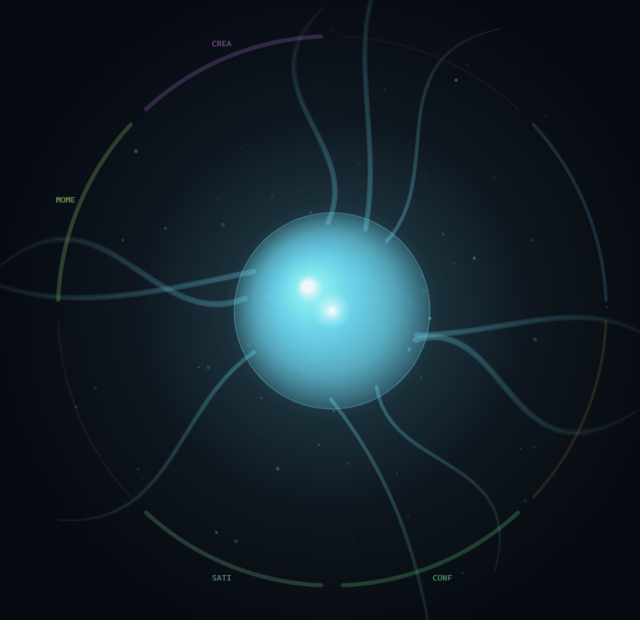

# Brain Ecosystem

[](https://github.com/timmeck/brain-ecosystem/actions/workflows/ci.yml)
[](https://www.npmjs.com/package/@timmeck/brain)
[](https://www.npmjs.com/package/@timmeck/brain)
[](LICENSE)
[](https://github.com/timmeck/brain-ecosystem)

**An autonomous AI research system that observes itself, learns, evolves, and modifies its own code — built as MCP servers for Claude Code.**

Brain Ecosystem is a system of three specialized "brains" connected through a Hebbian synapse network. 30+ autonomous engines run in feedback loops — observing, detecting anomalies, forming hypotheses, testing them statistically, distilling principles, dreaming, debating, reasoning in chains, feeling emotions, evolving strategies genetically, and modifying their own source code. 390 MCP tools. 2496 tests. The brain literally thinks about itself, gets curious, runs experiments, and writes code to improve itself.

## Packages

| Package | Version | Description | Ports |
|---------|---------|-------------|-------|
| [@timmeck/brain](packages/brain) | [](https://www.npmjs.com/package/@timmeck/brain) | Error memory, code intelligence, autonomous research & code generation | 7777 / 7778 / 7788 |
| [@timmeck/trading-brain](packages/trading-brain) | [](https://www.npmjs.com/package/@timmeck/trading-brain) | Adaptive trading intelligence with signal learning & backtesting | 7779 / 7780 |
| [@timmeck/marketing-brain](packages/marketing-brain) | [](https://www.npmjs.com/package/@timmeck/marketing-brain) | Content strategy, engagement & cross-platform optimization | 7781 / 7782 / 7783 |
| [@timmeck/brain-core](packages/brain-core) | [](https://www.npmjs.com/package/@timmeck/brain-core) | Shared infrastructure — 30+ engines, synapses, IPC, MCP, dream, consciousness, prediction, codegen, reasoning, emotions, evolution, self-modification | — |

## Quick Start

```bash
npm install -g @timmeck/brain
brain setup
```

That's it. One command configures MCP, hooks, and starts the daemon. Brain is now learning from every error you encounter.

### Optional: Add more brains

```bash
npm install -g @timmeck/trading-brain
trading setup

npm install -g @timmeck/marketing-brain
marketing setup
```

### Setup with Cursor / Windsurf / Cline / Continue

All brains support MCP over HTTP with SSE transport:

```json
{
  "brain": { "url": "http://localhost:7778/sse" },
  "trading-brain": { "url": "http://localhost:7780/sse" },
  "marketing-brain": { "url": "http://localhost:7782/sse" }
}
```

## What It Does

### Brain — Error Memory, Code Intelligence & Full Autonomy

134 MCP tools. Remembers errors, learns solutions, runs 40-step autonomous research cycles, dreams, debates, reasons, feels, and modifies its own code.

- **Error Memory** — Track errors, match against known solutions with hybrid search (TF-IDF + vector + synapse boost)
- **Code Intelligence** — Register and discover reusable code modules across all projects
- **Persistent Memory** — Remember preferences, decisions, context, facts, goals, and lessons across sessions
- **30+ Autonomous Engines** — SelfObserver, AnomalyDetective, HypothesisEngine, KnowledgeDistiller, CuriosityEngine, EmergenceEngine, DebateEngine, NarrativeEngine, ReasoningEngine, EmotionalModel, EvolutionEngine, GoalEngine, MemoryPalace, AttentionEngine, TransferEngine, MetaCognitionLayer, AutoExperimentEngine, SelfTestEngine, TeachEngine, SimulationEngine, DataScout, SelfScanner, SelfModificationEngine, and more
- **Dream Mode** — Offline memory consolidation: replay, prune, compress, decay during idle
- **Mission Control Dashboard** — Unified 7-tab dashboard at http://localhost:7788 (Consciousness Entity, Thought Stream, CodeGen, Self-Mod, Engines, Intelligence)

<p align="center"></p>

- **Prediction Engine** — Holt-Winters + EWMA forecasting, auto-calibration
- **ReasoningEngine** — Forward chaining, abductive reasoning, temporal inference, counterfactuals
- **EmotionalModel** — 8 emotion dimensions, 6 moods, mood-based behavior recommendations
- **EvolutionEngine** — Genetic algorithm for global parameter optimization (tournament, crossover, mutation)
- **SelfModificationEngine** — Scans own code, generates improvements via Claude API, tests before applying
- **BootstrapService** — Cold-start fix: seeds data so engines produce output from cycle 1
- **CodeGenerator + CodeMiner** — Autonomous code generation and GitHub repo mining
- **Signal Scanner** — Tracks GitHub trending repos, Hacker News, crypto signals
- **Semantic Search** — Local all-MiniLM-L6-v2 embeddings (23MB, no cloud required)
- **390 MCP Tools** across the ecosystem (134 brain + 128 trading + 128 marketing)

### Trading Brain — Adaptive Trading Intelligence

128 MCP tools. Learns from every trade outcome through Hebbian synapses and autonomous research.

- **Trade Outcome Memory** — Record and query trades with full signal context
- **Signal Fingerprinting** — RSI, MACD, Trend, Volatility classification
- **Backtesting Engine** — Run backtests, compare signals, Sharpe/PF/MaxDD/Equity Curve
- **Risk Management** — Kelly Criterion position sizing, drawdown tracking
- **Alert System** — 5 condition types, cooldown, webhooks, history
- **30+ Autonomous Engines** — Same full engine suite as Brain, with trading-specific DataMiner
- **Dream Mode, Consciousness, Prediction, Reasoning, Emotions, Evolution** — All autonomous features active
- **Mission Control Dashboard** — Unified dashboard at http://localhost:7788

### Marketing Brain — Self-Learning Marketing Intelligence

128 MCP tools. Learns what content works across platforms.

- **Post Tracking** — Store posts with platform, format, hashtags, engagement history
- **Competitor Analysis** — Track and benchmark competitor engagement
- **Content Generation** — Draft posts from learned patterns, rules, and templates
- **Scheduling Engine** — Post queue with optimal auto-timing
- **Cross-Platform** — Optimize for X, LinkedIn, Reddit, Bluesky, Mastodon, Threads
- **30+ Autonomous Engines** — Same full engine suite as Brain, with marketing-specific DataMiner
- **Dream Mode, Consciousness, Prediction, Reasoning, Emotions, Evolution** — All autonomous features active
- **Mission Control Dashboard** — Unified dashboard at http://localhost:7788

## Architecture

```
+------------------+     +------------------+     +------------------+
|   Claude Code    |     |  Cursor/Windsurf |     |  Browser/CI/CD   |
|   (MCP stdio)    |     |  (MCP HTTP/SSE)  |     |  (REST API)      |
+--------+---------+     +--------+---------+     +--------+---------+
         |                        |                        |
         +----------+-------------+------------------------+
                    |
         +----------+-----------+
         |     Brain Core       |
         |  IPC . MCP . REST    |
         +----------+-----------+
                    |
    +---------------+---------------+
    |               |               |
    v               v               v
+---+----+    +-----+------+   +---+----------+
|  Brain |    |  Trading   |   |  Marketing   |
| :7777  |<-->|  Brain     |<->|  Brain       |
| :7778  |    |  :7779     |   |  :7781       |
| :7788  |    |  :7780     |   |  :7782       |
+---+----+    +-----+------+   |  :7783       |
    |               |          +---+----------+
    |               |               |
    v               v               v
+--------+    +------------+   +--------------+
| SQLite |    |   SQLite   |   |   SQLite     |
+--------+    +------------+   +--------------+

Cross-brain peering via IPC named pipes
```

### Autonomous Research Layer

Every brain runs the ResearchOrchestrator with 40 feedback steps and 30+ engines:

```
                              ResearchOrchestrator (40 steps)
                                         |
          +--------+--------+-----------++-----------+--------+--------+
          |        |        |            |            |        |        |
          v        v        v            v            v        v        v
      Self     Anomaly   Cross       Adaptive     Exper.   Knowl.  Research
     Observer  Detect.   Domain      Strategy     Engine   Distill  Agenda
          |        |        |            |            |        |        |
          +--------+--------+---+--------+------------+--------+--------+
                                |
     +----------+----------+---+---+----------+----------+----------+
     |          |          |       |          |          |          |
     v          v          v       v          v          v          v
  Dream     Predict.   AutoResp  Hypoth.  CodeGen   CodeMiner  Attention
  Engine    Engine     (action)  Engine   (Claude)  (GitHub)   Engine
     |          |          |       |          |          |          |
     +----------+----------+---+---+----------+----------+----------+
                                |
  +----------+----------+------+------+----------+----------+----------+
  |          |          |             |          |          |          |
  v          v          v             v          v          v          v
Transfer  Narrative  Curiosity    Emergence  Debate    MetaCog    AutoExp
Engine    Engine     Engine       Engine     Engine    Layer      Engine
  |          |          |             |          |          |          |
  +----------+----------+------+------+----------+----------+----------+
                               |
  +----------+----------+------+------+----------+----------+----------+
  |          |          |             |          |          |          |
  v          v          v             v          v          v          v
SelfTest  Teach    DataScout     Simulation MemPalace  Goal      Evolution
Engine    Engine   (GitHub/HN)   Engine     (graph)   Engine    Engine
  |          |          |             |          |          |          |
  +----------+----------+------+------+----------+----------+----------+
                               |
              +----------+-----+-----+----------+
              |          |           |          |
              v          v           v          v
          Reasoning  Emotional   SelfScan   SelfMod    Bootstrap
          Engine     Model       (code)     Engine     Service
```

### Shared Infrastructure (Brain Core)

| Component | Description |
|-----------|-------------|
| **IPC Protocol** | Length-prefixed JSON frames over named pipes / Unix sockets |
| **MCP Server** | Stdio transport for Claude Code with auto-daemon-start |
| **MCP HTTP Server** | SSE transport for Cursor, Windsurf, Cline, Continue |
| **REST API** | HTTP server with CORS, auth, SSE events, batch RPC |
| **Hebbian Synapse Network** | Weighted graph — "neurons that fire together wire together" |
| **ResearchOrchestrator** | 40-step feedback cycle, orchestrates 30+ engines every 5 minutes |
| **BootstrapService** | Cold-start fix: seeds observations, journal, hypotheses, metrics on first cycle |
| **DataMiner** | Bootstraps historical DB data into research engines, incremental mining |
| **Dream Engine** | Offline consolidation — memory replay, synapse pruning, compression, decay |
| **ThoughtStream + Consciousness** | Real-time thought capture + live Consciousness Entity visualization (mood-colored orb, emotional dimension ring, ambient particles, floating thoughts) |
| **Prediction Engine** | Holt-Winters + EWMA forecasting with auto-calibration |
| **AutoResponder** | Anomaly → automatic parameter adjustment, escalation, resolution |
| **AttentionEngine** | Dynamic focus, context detection, engine weight allocation |
| **TransferEngine** | Cross-brain knowledge transfer, analogies, cross-domain rules |
| **NarrativeEngine** | Brain explains itself in natural language, finds contradictions |
| **CuriosityEngine** | Knowledge gap detection, UCB1 explore/exploit, blind spot detection |
| **EmergenceEngine** | Emergent behavior detection, complexity metrics, phase transitions |
| **DebateEngine** | Multi-agent debates, advocatus diaboli, consensus synthesis |
| **MetaCognitionLayer** | Engine performance grading (A-F), frequency adjustment |
| **ParameterRegistry** | Central tunable parameter store with 30+ parameters |
| **AutoExperimentEngine** | Autonomous parameter tuning with snapshot/rollback |
| **EvolutionEngine** | Genetic algorithm for global parameter optimization |
| **ReasoningEngine** | Forward chaining, abductive reasoning, temporal inference, counterfactuals |
| **EmotionalModel** | 8 emotion dimensions, 6 moods, mood-based recommendations |
| **GoalEngine** | Goal planning with progress tracking and forecasting |
| **MemoryPalace** | Knowledge graph with BFS pathfinding and connection building |
| **SelfTestEngine** | Tests if brain truly understands its own principles |
| **TeachEngine** | Generates teaching packages for other brains |
| **SimulationEngine** | What-if scenarios via CausalGraph + PredictionEngine |
| **DataScout** | External data from GitHub/npm/HN |
| **SelfScanner** | Indexes own source code for self-modification context |
| **SelfModificationEngine** | Generates and tests code changes autonomously via Claude API |
| **CodeGenerator + CodeMiner** | Code generation with brain context + GitHub repo mining |
| **Mission Control** | Unified 7-tab dashboard: Overview, Consciousness (Entity visualization), Thoughts, CodeGen, Self-Mod, Engines, Intelligence |
| **Signal Scanner** | GitHub trending, Hacker News, crypto signal tracking |
| **Webhook / Export / Backup** | HMAC webhooks, JSON/CSV export, SQLite backups |
| **Memory System** | Persistent memory with categories, importance, FTS5 search |
| **Cross-Brain** | Peer discovery, event notifications, cross-brain correlation |

## Port Map

| Service | Port | Protocol |
|---------|------|----------|
| Brain REST API | 7777 | HTTP |
| Brain MCP | 7778 | SSE |
| Trading Brain REST | 7779 | HTTP |
| Trading Brain MCP | 7780 | SSE |
| Marketing Brain REST | 7781 | HTTP |
| Marketing Brain MCP | 7782 | SSE |
| Marketing Dashboard | 7783 | SSE |
| Mission Control | 7788 | HTTP + SSE |

## CLI Commands

Each brain provides a full CLI:

```bash
# Brain
brain setup / start / stop / status / doctor
brain query <text> / modules / insights / network / dashboard
brain learn / explain <id> / export / import <dir> / peers

# Trading Brain
trading setup / start / stop / status / doctor
trading query <text> / insights / rules / network / dashboard
trading export / import <file> / peers

# Marketing Brain
marketing setup / start / stop / status / doctor
marketing post <platform> / campaign create <name> / campaign stats <id>
marketing insights / rules / suggest <topic> / query <search>
marketing dashboard / network / export / peers
```

## Environment Variables

| Brain | Data Dir | Config |
|-------|----------|--------|
| Brain | `BRAIN_DATA_DIR` (default: `~/.brain`) | `~/.brain/config.json` |
| Trading Brain | `TRADING_BRAIN_DATA_DIR` (default: `~/.trading-brain`) | `~/.trading-brain/config.json` |
| Marketing Brain | `MARKETING_BRAIN_DATA_DIR` (default: `~/.marketing-brain`) | `~/.marketing-brain/config.json` |

Additional keys: `ANTHROPIC_API_KEY` (enables CodeGenerator), `GITHUB_TOKEN` (enables CodeMiner + Signal Scanner).

## Docker

```bash
docker-compose up -d          # Start all three brains
docker-compose up brain       # Just the main brain
docker-compose logs trading-brain
docker-compose down
```

## Development

```bash
git clone https://github.com/timmeck/brain-ecosystem.git
cd brain-ecosystem
npm install          # installs all workspace dependencies
npm run build        # builds all packages (brain-core first)
npm test             # runs all 2496 tests
```

### Package Dependencies

```
brain-core          (no internal deps)
   ^
   |
   +-- brain        (depends on brain-core)
   +-- trading-brain (depends on brain-core)
   +-- marketing-brain (depends on brain-core)
```

## Tech Stack

- **TypeScript** — Full type safety, ES2022 target, ESM modules
- **better-sqlite3** — Fast, embedded, synchronous database with WAL mode
- **MCP SDK** — Model Context Protocol (stdio + HTTP/SSE transports)
- **@huggingface/transformers** — Local ONNX sentence embeddings (23MB, no cloud)
- **Claude API** — Code generation with brain knowledge context
- **Commander** — CLI framework
- **Winston** — Structured logging with file rotation
- **Vitest** — 2496 tests across the ecosystem

## Support

If Brain helps you, consider giving it a star.

[](https://github.com/timmeck/brain-ecosystem)
[](https://github.com/sponsors/timmeck)
[](https://paypal.me/tmeck86)

## License

[MIT](LICENSE)
